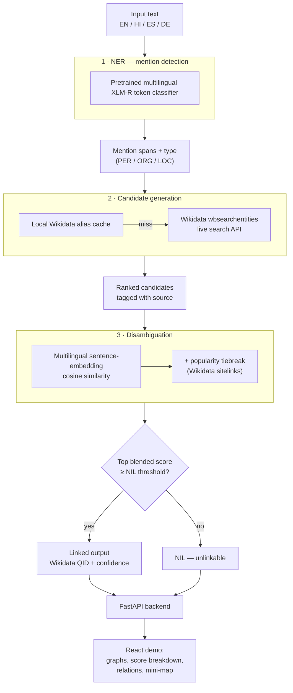

# LinguaLink — Multilingual Entity Linking & Disambiguation

End-to-end Named Entity Recognition (NER) and Entity Linking (EL) across **English, Hindi,
Spanish, and German**, resolving mentions in free text to concrete Wikidata entities using
multilingual transformer embeddings for cross-lingual disambiguation — with a UI that shows
its work: candidate rankings, disambiguation graphs, and the exact score arithmetic behind
every linking decision.

See [`docs/PROJECT_REPORT.md`](docs/PROJECT_REPORT.md) for the full project write-up (background,
experiments, and findings behind the design decisions below).

---

## What it does

Given a sentence like *"Barack Obama met Angela Merkel in Berlin,"* the pipeline:

1. **Detects** each named entity mention and its type (Person / Organization / Location).
2. **Generates candidates** — plausible Wikidata entities the mention could refer to.
3. **Disambiguates** — ranks those candidates by how well their description matches the
   mention's actual context, so "Amazon" the company and "Amazon" the river resolve
   differently depending on the sentence around them.
4. **Links** the mention to a concrete Wikidata QID (or returns NIL if no candidate is
   confident enough), and lets you inspect *why* that candidate won.

## Features

- **Multilingual NER** across en/hi/es/de, with truecasing to recover accurate detection on
  casual, lowercase, unpunctuated input.
- **Hybrid candidate generation**: a fast local Wikidata alias cache, falling back to
  Wikidata's live relevance-ranked search API for mentions not in the cache — every candidate
  is tagged with which source produced it.
- **Context-aware disambiguation** using multilingual sentence embeddings (cosine similarity),
  with a small, tunable popularity (Wikidata sitelink count) tiebreak for close calls.
- **Full explainability in the UI**, not just a final answer:
  - A **disambiguation graph** per mention — every candidate it competed against, with edge
    thickness/opacity showing similarity strength and the winner highlighted.
  - A **score breakdown table** showing the exact semantic score, popularity score, and
    blended score per candidate, plus the real formula and NIL threshold used.
  - A plain-English **"why this entity won"** explanation, including the cases where the
    popularity tiebreak — not raw semantic similarity — decided the outcome.
  - **Candidate source badges** (local cache vs. live search) so it's clear why some mentions
    resolve instantly with one candidate and others search through ten.
  - A **relations panel** (occupation, country, founder, etc., pulled live from Wikidata),
    with an embedded mini-map for entities that have a coordinate location.
- **Interactive demo app** — FastAPI backend + React frontend, with a live pipeline-progress
  stepper and highlighted, color-coded entity text.

## Architecture



A second, independently-trained NER model (fine-tuned XLM-R on WikiAnn) also lives in this
repo for comparison — it scores higher on in-domain WikiAnn test data, but the pretrained
checkpoint above generalizes far better to real, casual text and is what the running system
actually uses. See `configs/ner_xlmr.yaml` for the full comparison and reasoning.

## Tech stack

| Layer | Technology |
|---|---|
| NER / embeddings | PyTorch, Hugging Face Transformers, Sentence-Transformers |
| Knowledge base | Wikidata (SPARQL + action API), Wikipedia REST API |
| Backend API | FastAPI, Uvicorn |
| Frontend | React 18, Vite |
| Data / eval | pandas, scikit-learn, seqeval |

## Project layout

```
src/mel/
  ner/          NER model training, fine-tuning, inference
  linking/      candidate generation + disambiguation/ranking + NIL detection
  data/         dataset loading & preprocessing (WikiAnn, Wikidata, Mewsli-9, casual augmentation)
  eval/         NER F1 and linking-accuracy evaluation, per-language reporting
  utils/        shared helpers (config loading, HTTP retry, language codes)
configs/        YAML configs per experiment (model, language set, hyperparameters)
scripts/        CLI entry points (download data, train, evaluate, build KB cache, run pipeline)
notebooks/      exploratory analysis (Colab GPU training notebook)
data/           raw/processed datasets and local knowledge-base cache (gitignored)
models/         trained checkpoints (gitignored)
demo/
  backend/              FastAPI app (main.py) — Option B deployment
  frontend/             React app ("LinguaLink") — Vite + plain CSS, no UI framework dependency;
                        also the source for the Streamlit-embedded bundle (npm run build:streamlit)
  streamlit_component/  Python wrapper + prebuilt frontend_dist/ for the Streamlit custom
                        component — see streamlit_app.py (Option A deployment)
tests/          unit tests
results/        evaluation output tables/plots (gitignored except .gitkeep)
streamlit_app.py          Streamlit Community Cloud entrypoint (Option A — see Deployment)
Dockerfile                backend-only image for container deployment, e.g. Cloud Run (Option B)
requirements-backend.txt  runtime-only deps for the Docker image (excludes training/eval extras)
```

## Getting started

### Prerequisites

- Python ≥ 3.9
- Node.js (LTS) + npm
- ~2 GB free disk (transformer model downloads on first run)

### Backend

```bash
python -m venv .venv
.venv\Scripts\activate          # Windows PowerShell; use source .venv/bin/activate on macOS/Linux
pip install -r requirements.txt

# Optional but recommended: build the local Wikidata alias cache so common
# demo entities resolve instantly instead of always hitting the live search API.
python scripts/build_kb_index.py --languages en hi es de

# Start the API (http://localhost:8000)
uvicorn demo.backend.main:app --reload --port 8000
```

### Frontend

```bash
cd demo/frontend
npm install
npm run dev              # http://localhost:5173, proxies /api -> localhost:8000
```

Open `http://localhost:5173`, pick a language, and run one of the example sentences.

## Configuration

| Variable | Where | Default | Purpose |
|---|---|---|---|
| `ALLOWED_ORIGINS` | backend env | `http://localhost:5173` | Comma-separated list of frontend origins allowed by CORS |
| `VITE_API_BASE_URL` | frontend `.env` (build-time) | `/api` (dev proxy) | Base URL the frontend calls for the backend API |

See `demo/frontend/.env.example`.

## Evaluation

```bash
python scripts/download_data.py --languages en hi es de
python scripts/train_ner.py --config configs/ner_xlmr.yaml     # optional — reproduces our fine-tune
python scripts/evaluate.py --config configs/eval.yaml
```

**NER (fine-tuned model, WikiAnn test set):**

| Language | F1 |
|---|---|
| English | 0.839 |
| Hindi | 0.890 |
| Spanish | 0.914 |
| German | 0.883 |

The demo itself runs the pretrained `Davlan/xlm-roberta-base-ner-hrl` checkpoint instead (see
Architecture above) — this table reflects our own fine-tune's in-domain result, not demo-time
accuracy.

**Linking accuracy** is currently measured against a small, hand-authored gold set
(`data/processed/linking_eval_set.jsonl`, ~35 examples/language for en, fewer for hi/es/de).
A larger, more representative eval set built from **Mewsli-9** (`scripts/build_mewsli_eval.py`,
covering en/es/de — Mewsli-9 has no Hindi split, so hand-authored Hindi examples are kept
alongside it) has been built into `data/processed/mewsli9_eval.jsonl` but is not yet the
default in `configs/eval.yaml`; see [`docs/PROJECT_REPORT.md`](docs/PROJECT_REPORT.md) for
current numbers and honest caveats.

## Deployment

Two shapes are supported, depending on what you need.

### Option A: Streamlit Community Cloud — one deploy, free, no card required

`streamlit_app.py` (repo root) runs the entire pipeline **and** the React UI — embedded
unchanged, via a Streamlit custom component (`demo/streamlit_component/`) — as a single
self-contained app. No separate backend, no CORS config, no API base URL: the UI talks to
Python directly through Streamlit's component bridge instead of HTTP. This is the only
deployment path here that's genuinely free with no payment method required at all.

1. Build and commit the embedded frontend bundle — **this step is required before every
   deploy**, since Streamlit Community Cloud only runs `pip install -r requirements.txt` plus
   the Python entrypoint; it does not run an `npm`/Node build step:
   ```bash
   cd demo/frontend
   npm install
   npm run build:streamlit
   ```
   This writes `demo/streamlit_component/frontend_dist/` — commit that output.
2. Push to GitHub, go to [streamlit.io/cloud](https://streamlit.io/cloud) → **New app**, pick
   this repo, set **Main file path** to `streamlit_app.py`.
3. Deploy. No environment variables needed.

**Honest caveat**: Community Cloud's free tier gives 1 GB RAM, and this app loads two
transformer models (NER + sentence-embeddings) that can each approach that on their own in
float32 — verified working locally (full RAM available), but not yet verified against
Streamlit Cloud's actual memory quota. If it gets OOM-killed there, the fix is shrinking/
quantizing the models (see `configs/linking.yaml` and `configs/ner_xlmr.yaml` for what's
currently loaded), not a deployment setting.

### Option B: Separate frontend (Vercel) + backend (elsewhere)

Use this if you'd rather host the UI and API independently, or want the FastAPI JSON API
callable on its own. The frontend and backend have very different hosting requirements here,
so **they deploy separately** — do not try to put both on Vercel.

#### Frontend → Vercel

This is a good fit: it's a static Vite/React build with no server-side code.

1. Import the repo into Vercel, set the **root directory to `demo/frontend`**. Vercel
   auto-detects the Vite framework preset (build command `npm run build`, output `dist`).
2. Add an environment variable **`VITE_API_BASE_URL`** pointing at your deployed backend's
   URL (see below) — e.g. `https://your-backend.onrender.com`. Without this, the production
   build has no dev proxy and every API call will 404.
3. Deploy. Vercel gives you a `https://<project>.vercel.app` URL (plus a per-PR preview URL).

#### Backend → NOT Vercel

The backend is a long-running FastAPI process that loads multi-hundred-MB PyTorch/Transformers
models into memory and keeps them warm across requests. This doesn't fit Vercel's serverless
Python runtime, which has a ~250 MB deployment size limit (torch + transformers +
sentence-transformers alone exceed that), execution timeouts unsuited to model inference, and
no persistent process to keep a loaded model warm between invocations — every cold start would
re-download and re-load the models from scratch.

Deploy it instead to a platform that runs a persistent process with enough memory for two
transformer models loaded at once (2 GB+ recommended). Note: as of 2026, Hugging Face Spaces
requires a paid PRO plan to create a Docker or Gradio Space (even on free CPU hardware) — it's
not a free option here despite older guidance suggesting otherwise.

**Google Cloud Run (recommended free option)** — genuinely free within a generous monthly quota,
scales to zero when idle (no cost while unused), and runs the `Dockerfile` at the repo root
as-is:

1. Install the `gcloud` CLI, then from the repo root:
   `gcloud run deploy lingualink-backend --source . --memory 2Gi --allow-unauthenticated`
   (Cloud Run injects `$PORT` automatically — the Dockerfile already reads it.)
2. Set **`ALLOWED_ORIGINS`** as an environment variable on the service to your Vercel
   frontend's URL(s), comma-separated.
3. Your backend is reachable at the `*.run.app` URL Cloud Run prints after deploy.

**Render / Railway / Fly.io / a plain VM** — also work with the same `Dockerfile`, or without
one:

1. Start command: `uvicorn demo.backend.main:app --host 0.0.0.0 --port $PORT`
2. Install dependencies from the repo root's `requirements.txt` (or `requirements-backend.txt`
   for a lighter install).
3. Set **`ALLOWED_ORIGINS`** to your Vercel frontend's URL(s), comma-separated
   (e.g. `https://your-app.vercel.app,https://your-app-git-main-yourname.vercel.app`).
   Note: Render's free tier (512 MB RAM) is likely too small for two loaded transformer
   models — expect to need at least a 2 GB paid instance there.

Either way:

- Optional but recommended: run `python scripts/build_kb_index.py --languages en hi es de`
  before deploying and include `data/kb/wikidata_aliases.parquet` in the deploy. `data/kb/*`
  is gitignored, so a fresh deploy without this step still works — every candidate lookup just
  falls back to the live Wikidata search API, which is slower and subject to rate limits.
- The first request after a cold start will be slow while models download and load.

## Known limitations

- The linking-accuracy gold set is small; Mewsli-9 integration (above) is the clear next step.
- Genuine real-world ambiguity (e.g., a bare "Ronaldo") can't be resolved by any signal this
  system has — a human reader would face the same ambiguity.
- Wikidata's live APIs are a real operational dependency: they've been observed under
  aggressive rate-limiting during development. The system retries with backoff, but a
  high-traffic deployment should get an authenticated Wikidata API key.
- Not yet deployed anywhere at the time of writing — this section will need the live URLs
  added once that happens.

See [`docs/PROJECT_REPORT.md`](docs/PROJECT_REPORT.md) §2.4 and §6 for the complete, honestly
documented list, including specific bugs found and fixed during development.

## Credits

- [Wikidata](https://www.wikidata.org) and [Wikipedia](https://www.wikipedia.org) — knowledge
  base and entity descriptions, via their public APIs.
- [WikiAnn](https://huggingface.co/datasets/unimelb-nlp/wikiann) — multilingual NER training data.
- [Mewsli-9](https://github.com/google-research/google-research/blob/master/dense_representations_for_entity_retrieval/mel/mewsli-9.md)
  (Botha, Shan & Gillick, EMNLP 2020) — multilingual entity-linking evaluation data.
- [Sentence-Transformers](https://www.sbert.net) — multilingual embedding models.

## License

No license file has been added yet. Add one (e.g. MIT) before treating this as open for reuse.
